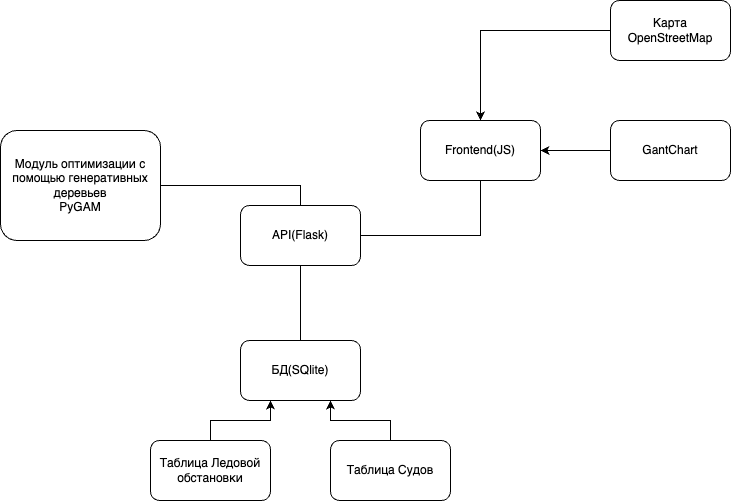

## Общее описание решения
Решение кейса представляет собой цифровой сервис, который для формирования оптимального графика работы транспортного и 
ледокольного флота СМП использует графовые генративные деревья решений. Результатом будет гант-чарт расписания ледокольных 
проводок на месяц и визуализация маршрутов судов на карте.

## Технические особенности:
PyGAN Flask, Numpy, Pandas

## Уникальность:
В решении применяется генративная моделья для оптимизации проводок судов для эффективного распределения движения 
ледокольного флота.

## Script to build and run the project
Executing a serial command
virtualenv -p python3 env
source env/bin/activate
pip install -r requirements.txt

## Start frontend service
cd /front 
nmp install
nmp run dev

## Start backend model
python3 app.py

## Start test model
cd /ai
jupyter GAN2_new.ipynb
